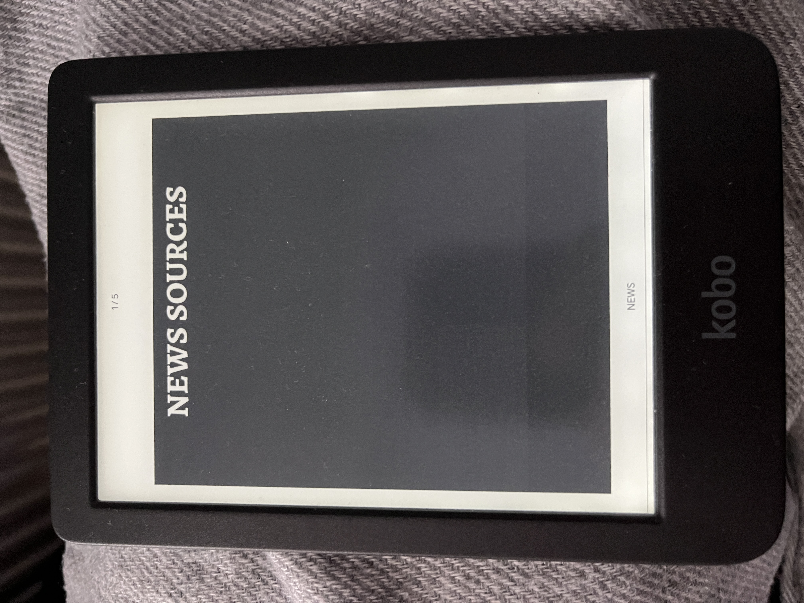
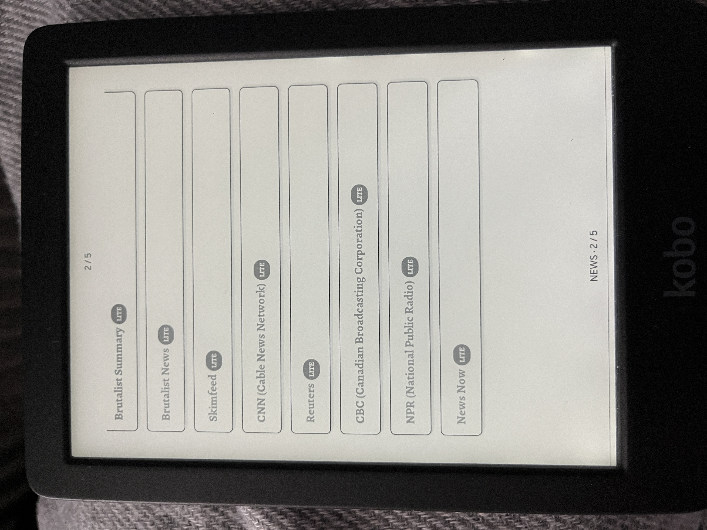
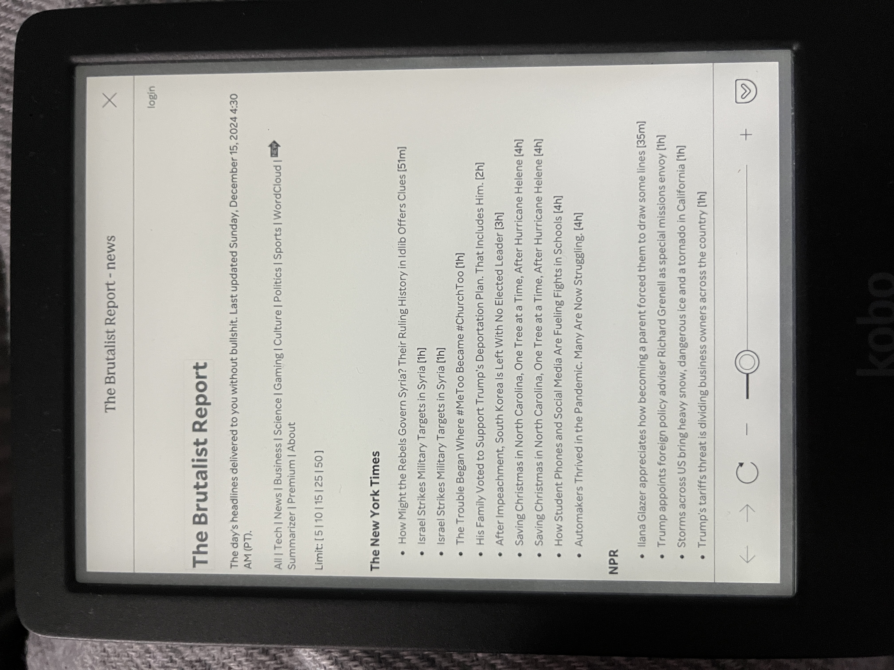
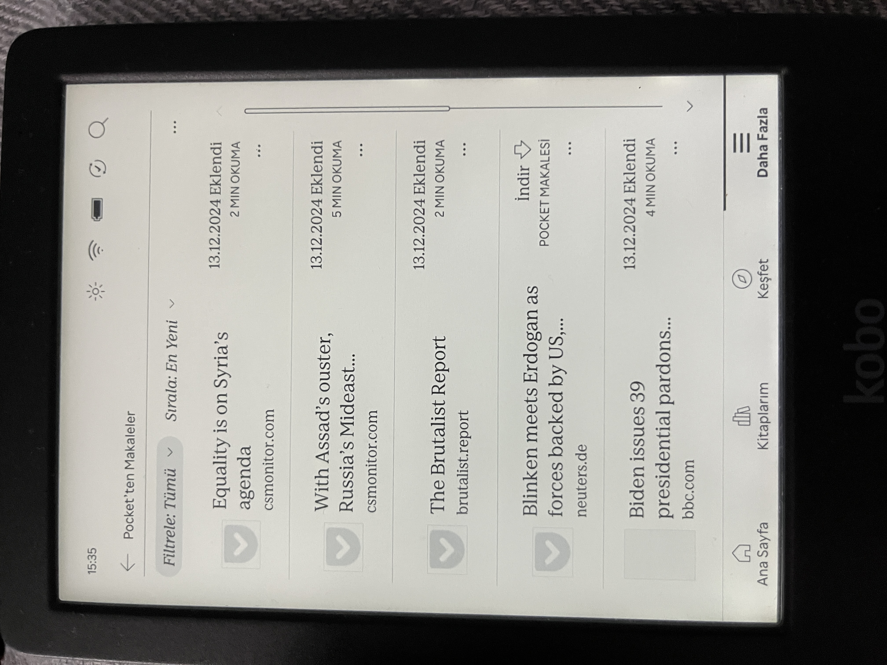

# Lightweight News for E-Readers 📰

This project provides a simple and lightweight HTML file designed to display news links on e-readers.

#️⃣ e-reader
#️⃣ kobo
#️⃣ kobo clara bw
#️⃣ kindle
#️⃣ news
#️⃣ getpocket
#️⃣ instapaper
#️⃣ rss

⚠️ [Pocket is deprecated.](https://getpocket.com/farewell) [Instapaper x Kobo partnership is announced](https://blog.instapaper.com/post/789685899750424576/instapaper-rakuten-kobo-integration) which probably will work the same.

### Why? 🔍

I have a Kobo Clara BW, which includes GetPocket integration feature for reading articles. However, to save articles, you must use an external device such as your mobile phone or computer. I searched for ways to do this directly on the device but couldn’t find any viable solution. GetPocket doesn’t provide RSS feeds automatically, requiring the use of third-party services. Kobo does not support JavaScript and latest versions of CSS in html files.

This project is not an app or a full solution—it’s simply a workaround. I hope it helps.

### Features ✨

- A Standalone Solution: No 3rd party or subscriptions needed.
- E-Reader Friendly: Optimized for devices like Kobo with lightweight, text-based links.
- Customizable: Edit the content to include your preferred news sources.
- Lightweight Design: Clean and simple interface with minimal styling.

### Screenshots 🖼️







## Instructions 🧑‍🏫

1️⃣ Download & Edit The File 🛠️

- Download the [this](generate.html) file.
- Open the file in any text editor (like Notepad, VSCode, or Sublime Text).
- Edit the content array in the script section:

```js
const content = [
  {
    title: 'UK 🇬🇧 BBC (British Broadcasting Corporation)',
    url: 'https://bbc.com/news',
    rssUrl: 'https://feeds.bbci.co.uk/news/world/rss.xml',
  },
];
```

2️⃣ Generate Static HTML

- Open the file on your browser.
- Open the console and copy the printed html element. (F12 -> Console)
- Create a new html file with the content.

3️⃣ Load the File on Your E-Reader 📱

- Connect your e-reader to your computer via USB.
- Copy the HTML file to a folder on your e-reader (e.g., Documents or News).
- Open the file on your e-reader’s web browser or file viewer.
- The resulting file should look like [this](news.html).

4️⃣ Usage

- In your e-reader, you can display the links as cards. Click on that cards and open the browser. You can open the articles and save to your pocket easily.

### Example Content 📰

⚠️ Selected websites do not represents any political opinion.

Here’s an example of how your content might look. Each entry consists of:

- title: Display name of the news source.
- url: URL to the news page.
- rssUrl: Optional RSS feed link (not used directly in the interface).
- liteUrl: Optional lite url news link.

```js
const content = [
  {
    title: 'US 🇺🇸 CNN (Cable News Network)',
    url: 'https://edition.cnn.com/world',
    rssUrl: '',
    liteUrl: 'https://lite.cnn.com',
  },
  {
    title: 'UK 🇬🇧 BBC (British Broadcasting Corporation)',
    url: 'https://bbc.com/news',
    rssUrl: 'https://feeds.bbci.co.uk/news/world/rss.xml',
  },
  {
    title: 'Qatar 🇶🇦 Al Jazeera',
    url: 'https://aljazeera.com/news',
    rssUrl: 'https://aljazeera.com/xml/rss/all.xml',
  },
];
```

### Contributing 🤝

I probably will not update this repository but feel free to do so.

- You can fork and create merge requests.
- You can add more lightweight news websites if they are not in the list.

### License 📄

This project is licensed under the MIT License. See the LICENSE file for details.

Happy reading! 📚

👱🏻‍♂️ github.com/aliakgul
